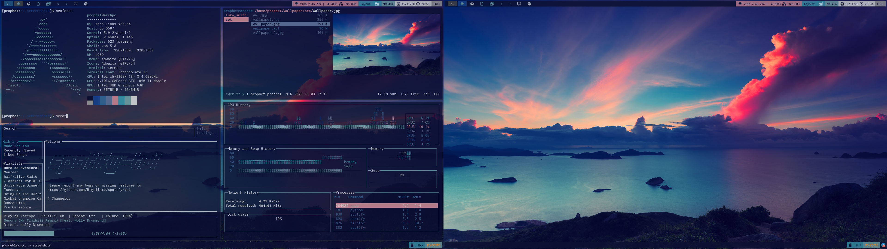

# Fred's Dotfiles
These are the configuration files for my Arch Linux installation

## Screenshot

## Used Applications
- **Window Manager:** Wayland (the images above are still from Qtile, which I used before)
- **Shell:** zsh (+oh\_my\_zsh)
    - **Theme:** PowerLevel10k
- **Terminal:** ghostty
- **Terminal multiplexer:** tmux
- **TUI File Manager:** 
    - Ranger (with ueberzug to visualize images)
    - vifm
- **Text Editor:** Neovim
    - **Plugin manager:** Lazy.nvim
    - To get a list of the plugins I am using refer to [The Lazy config file](https://github.com/fredmny/dotfiles/blob/master/.config/nvim/lua/plugins/lazy.lua)
- **GUI File Manager:** pcmanfm
- **Audio Player:** Spotify - controlled through spotify-tui
- **System Monitoring Dashboard:** gtop
- **GTK Appearance Management:** nwg-look (Previouslya: lxappearance)
- **Browser:** firefox / Zen
- **Video Player:** mpv
- **Screenshot tool:** [flameshot](https://flameshot.org/)
- **Audo Engine:** [Pipewire](https://pipewire.org/) with [EasyEffects](https://github.com/wwmm/easyeffects) to control it
- **Launcher:** [rofi](https://github.com/davatorium/rofi)
- **Note taking:** Obsidian
- **Notifications:** [mako](https://github.com/emersion/mako)
- **Misc terminal tools:**
    - fzf
    - lazygit
    - zoxide
    - bat
    - lazygit
    - lazydocker
    - ascii-image-converter
    - [The Fuck](https://github.com/nvbn/thefuck)

### Other Scripts and Tools
- [Shell Color Scripts](https://gitlab.com/dwt1/shell-color-scripts)

## Media Shortcuts
Media shortcuts working:
- **Increase/decrease screen brightness**
- **Increase/decrease volume**
- **Control spt (TUI Spotify player):** Play/pause, next song, previous song

## Colors
I am using *pywal* to control the colors of my terminal (main functionality of pywal) as well as of my window manager. 

To change the colors of the window manager I wrote a short *Python* script, that loads the pywal cached color scheme into a list, which is then used in my Qtile configuration file. If you are interested you can find the script [here](https://github.com/fredmny/dotfiles/blob/master/.config/qtile/pywal_colors.py). 

To change the wallpaper you can use the `wal -i {file}` command within the terminal or use the `bw` command within ranger. To apply the new colors to qtile only restart the environment (`Alt+Ctrl+r`).

## Wallpaper
The wallpapers for the screenshots are in the wallpaper folder. I got them from a collection from [Luke Smith](https://lukesmith.xyz/), that I downloaded some years ago. 

## How I manage my Dotfiles Repository
I do it with a bare git repository and would engourage you to do the same. Just check following links (I recommend watching the video from Derek Taylor/DistroTube for better understanding):
- [Original Article](https://www.atlassian.com/git/tutorials/dotfiles)
- [More in-depth explanation](https://www.ackama.com/blog/posts/the-best-way-to-store-your-dotfiles-a-bare-git-repository-explained)
- [Video from DT](https://www.youtube.com/watch?v=tBoLDpTWVOM)
